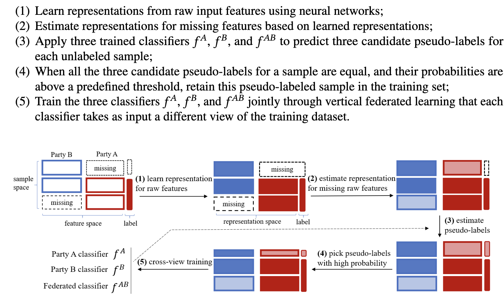

# FedCVT
This is the official repo for the paper [FedCVT: Semi-supervised Vertical Federated Learning with Cross-View Training](https://dl.acm.org/doi/10.1145/3510031). The arxiv version is available at [here](https://arxiv.org/abs/2008.10838)

Note that this codebase is the Pytorch implementation of FedCVT. The original implementation is based on Tensorflow. As a result, the empirical results of the Pytorch version may differ in those of the Tensorflow version, as reported in the paper.

## 1. Methodology

The workflow of FedCVT is described as follows and illustrated in the following figure.


## 2. Run the code

The entry points for running the experiments on Avazu, BHI and NUSWIDE are 
- fedcvt_avazu_exp_run.py, 
- fedcvt_bhi_exp_run.py, and
- fedcvt_nuswide_exp_run.py, respectively. 
  
You can change the hyperparameters in these python files.

## 3. Citation

If you think our work is helpful and used our code in your work, please cite our paper:
```
@article{10.1145/3510031,
author = {Kang, Yan and Liu, Yang and Liang, Xinle},
title = {FedCVT: Semi-supervised Vertical Federated Learning with Cross-view Training},
year = {2022},
issue_date = {August 2022},
publisher = {Association for Computing Machinery},
address = {New York, NY, USA},
volume = {13},
number = {4},
issn = {2157-6904},
url = {https://doi.org/10.1145/3510031},
doi = {10.1145/3510031},
abstract = {Federated learning allows multiple parties to build machine learning models collaboratively without exposing data. In particular, vertical federated learning (VFL) enables participating parties to build a joint machine learning model based upon distributed features of aligned samples. However, VFL requires all parties to share a sufficient amount of aligned samples. In reality, the set of aligned samples may be small, leaving the majority of the non-aligned data unused. In this article, we propose Federated Cross-view Training (FedCVT), a semi-supervised learning approach that improves the performance of the VFL model with limited aligned samples. More specifically, FedCVT estimates representations for missing features, predicts pseudo-labels for unlabeled samples to expand the training set, and trains three classifiers jointly based upon different views of the expanded training set to improve the VFL model’s performance. FedCVT does not require parties to share their original data and model parameters, thus preserving data privacy. We conduct experiments on NUS-WIDE, Vehicle, and CIFAR10 datasets. The experimental results demonstrate that FedCVT significantly outperforms vanilla VFL that only utilizes aligned samples. Finally, we perform ablation studies to investigate the contribution of each component of FedCVT to the performance of FedCVT.},
journal = {ACM Trans. Intell. Syst. Technol.},
month = {may},
articleno = {64},
numpages = {16},
keywords = {Vertical federated learning, semi-supervised learning, cross-view training}
}
```
